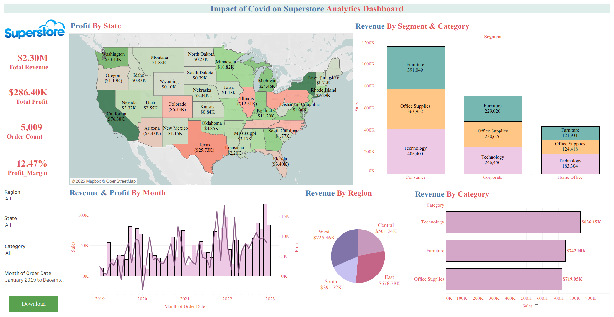
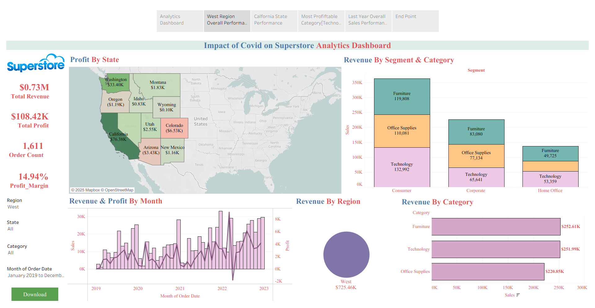
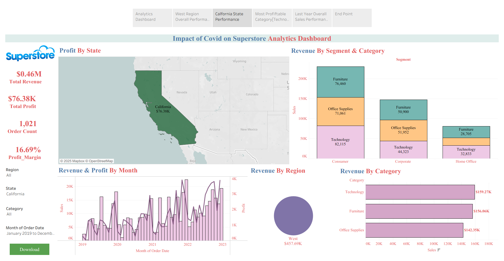
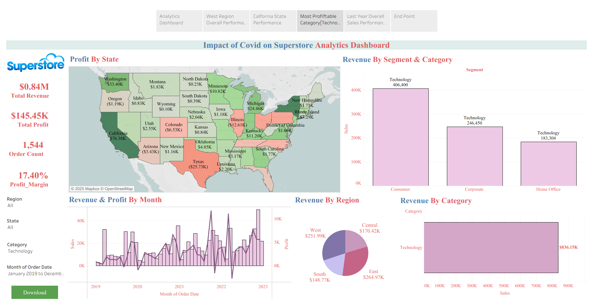
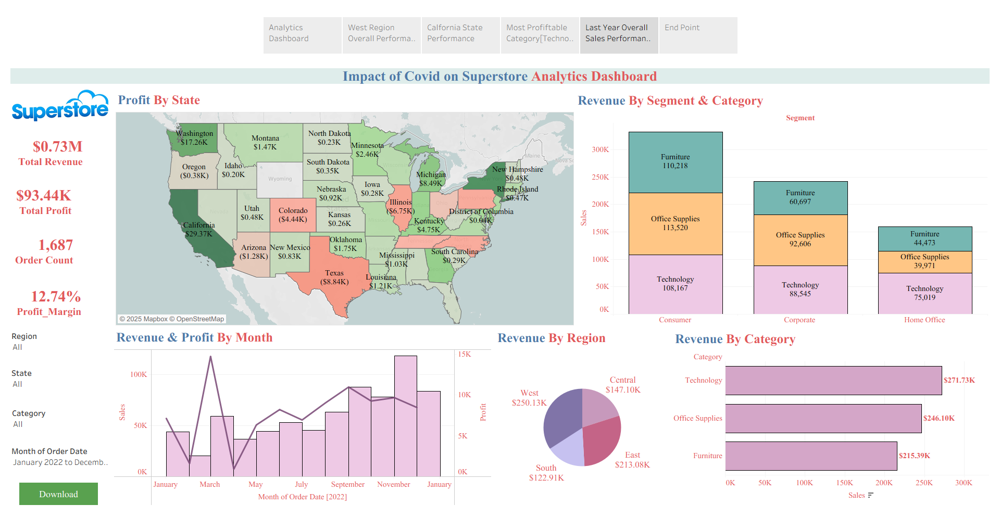

# 💡 Tableau Project by Yash Yennewar

# **Impact of Covid on Superstore Analytic Dashboard**
An interactive Tableau dashboard analyzing the impact of Covid on Superstore business performance across revenue, profit, regions, and customer segments.

## 📂 Project Link
<a href ="https://public.tableau.com/views/Superstore_Project_Analysis/DataStory?:language=en-US&publish=yes&:sid=&:redirect=auth&:display_count=n&:origin=viz_share_link">Impact of Covid on Superstore Analytics</a>

---

## 📌 Overview
This project presents an **interactive Tableau dashboard** analyzing **Impact of Covid on Superstore Business (2019–2022)**.
It highlights key metrics such as **Revenue, Profit, Orders and Profit Margins**, along with performance breakdowns by **Region, Category, Sub-Category, and Customer Segments**.   

---

## 📂 Project Files
- `Superstore_Project_Analysis.twbx` → Tableau packaged workbook (open in Tableau Desktop/Public).  
- `Dashboard.png` → Main Executive Dashboard (overview).  
- `DataStory-1.png`, `DataStory-2.png`, `DataStory-3.png`, `DataStory-4.png` → Story points highlighting **West Region performance, California State performance, Most Profitable Category and Last year sales**.  

---

## 📊 Key Metrics (KPIs)
1. **Total Revenue** – Total sales revenue year-to-date.  
2. **Total Profit** – Net profit across all orders.  
3. **Total Orders** – Total Orders year-to-date.  
4. **Profit Margin** – Profit Margin across all orders.
5. **Profit by State** – Geographic profitability analysis.  
6. **Revenue & Profit by Month** – Seasonality and monthly trends.  
7. **Revenue & Profit by Segment & Category** – Segment & Category driven analysis.
8. **Revenue & Profit by Category & Sub-Category** – Product-driven analysis.
9. **Regional Contribution to Overall Sales** – Identifying key growth markets.

---

## 📈 Dashboard Insights
### 🔹 1. Executive Dashboard
- **Overall Performance**:
  - 💵 **Total Revenue:** $2.30M  
  - 💹 **Total Profit:** $286.40K 
  - 📦 **Orders:** 5009
  - 📈 **Profit Margin:** 12.47%
- **Regional Performance**:  
  - 🏆 **West:** $725.46K (31.6%) – *Highest Revenue Contributor*
  - 🌐 **East:** $678.78K (29.5%)  
  - 🏙️ **Central:** $501.24K (21.8%)  
  - 🏡 **South:** $391.72K (17.0%) 
- **Category & Sub-Category Insights**  
  - 🖥️ **Top Revenue Categories:** Technology & Office Supplies  
  - 📱 **Phones & Chairs:** Each contributed $0.33M in revenue (*leading sub-categories*)  
  - ❌ **Lowest Performing:** Fasteners & Art  
- **Segment Analysis**  
  - 👥 **Consumer Segment:** Highest revenue ($1.16M) & profit ($134K)  
  - 🏢 **Corporate & Home Office:** Lagged comparatively  
- **Trend Analysis**  
  - 📉 Revenue dips observed during early **2020 (Covid onset)**  
  - 📈 Recovery in **2021–2022** with strong peaks in **late 2022 & early 2023**   

### 🔹 2. Data Story Highlights
- **West Region performance** → West Region performance with positive revenue & profit contribution.  
- **California State performance** → California State performance stands out with consistent growth and profitability in West Region.
- **Most Profitable Category** → Technology is the most profitability Category across all seasons.  
- **Last year sales** → December 2022 marked the **highest monthly sales** and February 2022 marked the **highest monthly profit**.  

---

## 📷 Visualizations
- **Dashboard View**  
    

- **Data Story 1 – Central Region**  
    

- **Data Story 2 – NYC Best Performer**  
    

- **Data Story 3 – November Peak Sales**  
  
  
- **Data Story 3 – November Peak Sales**  
    

---

## 🛠️ Tools & Technologies
- **Tableau Desktop / Tableau Public** – Data visualization and storytelling.  
- **Superstore Dataset** – Sample retail sales dataset (product, region, customer, order details).  

---

## 🚀 How to Use
1. Clone or download this repository.  
2. Open the file `Retail_Sales_Analysis.twbx` in Tableau Desktop or Tableau Public.  
3. Interact with filters (Region, City, Category, Time) to explore insights.  

---

## 📚 Learnings
- 🌍 Regional & segment-level insights help businesses identify their **strongest markets** and **growth areas**.  
- 🦠 Covid caused major disruption in **2020**, but categories like **Technology** recovered faster.  
- 👥 **Consumer-focused strategies** deliver stronger profitability compared to corporate/home office customers.   

---

## 📜 License
This project is for **educational and portfolio purposes** only. The dataset used is the **Tableau Superstore Sample Dataset**.

---
